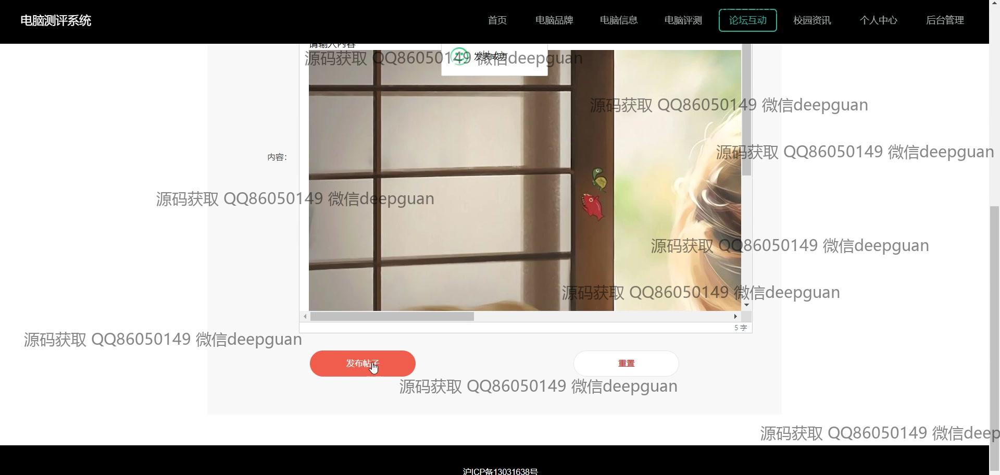
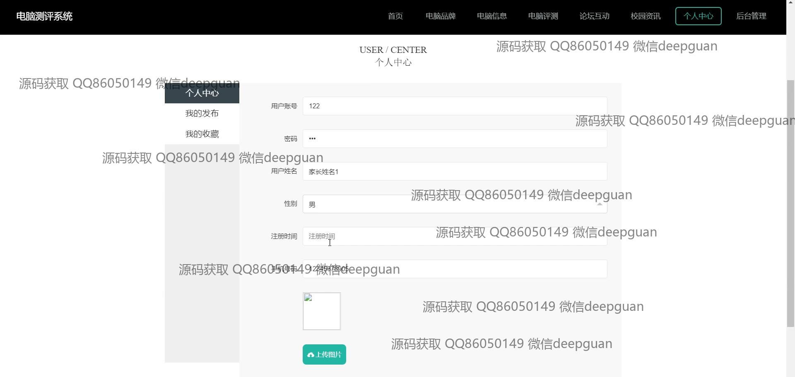
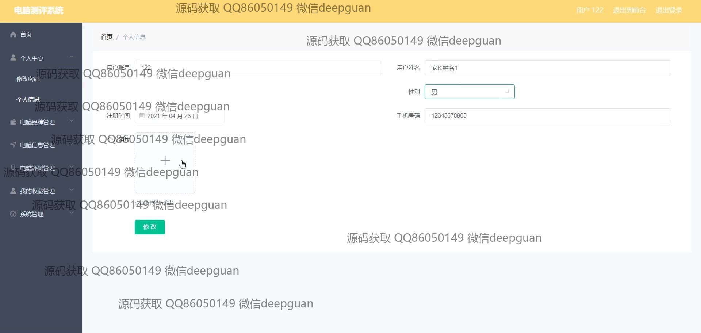
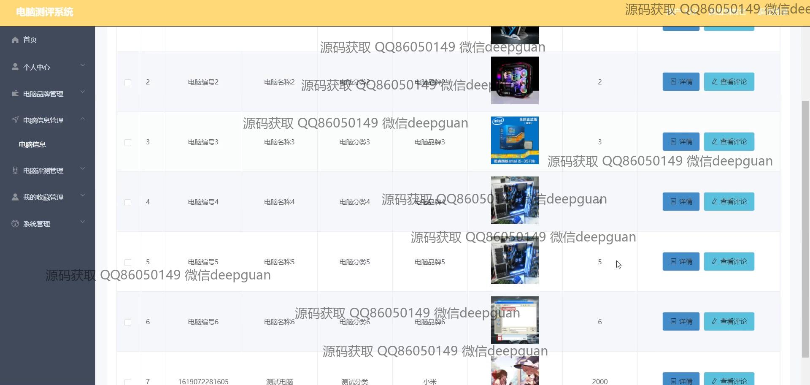

<h1 align="center">基于SSM框架的电脑测评系统+vue</h1>

## 简介
电脑测评系统：角色分为管理员、用户；功能包括品牌管理、用户管理、信息管理、测评管理、互动论坛和个人中心，支持信息录入、维护和编辑功能，界面设计简洁，高效便捷。    --计算机毕业设计源码；毕设源码；java毕业设计源码

## 联系方式

<h3 align="center">获取完整代码与数据库文件 + 微信：deepguan QQ: 86050149 QQ群: 783742310</h3>

<h3 align="center">可帮忙远程部署 包运行成功！提供远程部署、修改代码、设计文档指导、代码讲解等服务！</h3>

## 功能介绍（完整见运行截图）
管理员：系统提供全面的后台管理功能，包括个人中心、用户管理、电脑类型和品牌管理、电脑信息和测评管理、论坛互动、系统管理等模块。品牌管理功能支持品牌信息录入、修改和删除等操作。电脑信息管理允许管理员录入价格及配置信息，并使用富文本编辑器丰富内容。论坛互动功能让管理员管理和发布帖子，校园资讯模块支持编辑和发布新闻内容，支持多种文本格式。通过这些模块，管理员可以高效维护和更新系统内容。

用户：用户可通过注册、登录访问系统，浏览首页、品牌和电脑信息。个人中心支持用户个人信息的查看与修改，如账号、姓名、性别、手机号等。用户可以收藏感兴趣的电脑品牌及信息，查看个人发布和收藏的内容。电脑信息模块提供详细的品牌和产品信息展示，用户可查看评论，并与他人互动。用户还可在论坛板块发表帖子，与其他用户交流，增强社区互动体验。搜索及过滤功能帮助用户快速找到所需信息，提升用户使用体验。

## 运行截图

本代码来源于网络,仅供学习参考使用!

